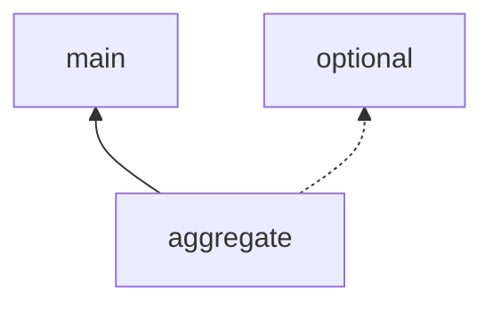

# parallel-flow

一个轻量级的异步编排框架，零外部依赖，基于 DAG（有向无环图）实现任务的自动并行调度。

适用于需要并行聚合多个数据源的场景，例如商品详情页聚合、多接口并行调用等 Fan-out/Fan-in 模式。

## 核心设计

- **声明式依赖**：通过 `dependsOn` / `weakDependsOn` 描述任务间的依赖关系，框架自动推导并行度
- **强弱依赖分离**：强依赖失败则下游取消；弱依赖失败不影响下游执行
- **一次性执行**：每个 `TaskNode` 仅可参与一次 Flow 编排尝试，收集 DAG 时会标记为已使用，通过 CAS 保证状态写入的原子性，避免并发下的状态污染
- **不中断超时**：超时机制不会 interrupt 任务线程，避免误打断 IO 操作，由任务自行控制内部超时
- **拓扑排序 + CompletableFuture 编排**：拓扑排序后构建 Future 依赖链，无依赖的节点自动并行提交

## 快速开始

### Maven

```xml
<dependency>
    <groupId>com.d8gmyself</groupId>
    <artifactId>parallel-flow</artifactId>
    <version>1.0.0-SNAPSHOT</version>
</dependency>
```

### 基础示例：并行聚合

```java
// 1. 定义各数据源节点（无依赖，自动并行）
TaskNode<String> productInfo = TaskNode.of("productInfo", ctx -> {
    return fetchProduct(ctx.get("productId"));
});

TaskNode<String> price = TaskNode.of("price", ctx -> fetchPrice());

TaskNode<String> reviews = TaskNode.of("reviews", ctx -> fetchReviews());

// 2. 定义聚合节点，声明对上游的强依赖
TaskNode<String> aggregate = TaskNode.<String>builder("aggregate", ctx -> {
    return productInfo.get() + "|" + price.get() + "|" + reviews.get();
}).dependsOn(productInfo, price, reviews).build();

// 3. 执行：只需指定目标节点，框架自动收集整个 DAG 并调度
FlowContext flowCtx = new FlowContext();
flowCtx.put("productId", "SKU-001");
String result = ParallelFlow.start(aggregate, flowCtx);
```

执行过程：`productInfo`、`price`、`reviews` 三个节点自动并行执行，全部完成后 `aggregate` 节点开始执行。

### 多层 DAG

```java
TaskNode<String> a = TaskNode.of("A", ctx -> "dataA");

TaskNode<String> b = TaskNode.<String>builder("B", ctx -> {
    return "B(" + a.get() + ")";
}).dependsOn(a).build();

TaskNode<String> c = TaskNode.<String>builder("C", ctx -> {
    return "C(" + a.get() + ")";
}).dependsOn(a).build();

// D 依赖 B 和 C，B 和 C 都依赖 A
// 执行顺序：A → B,C 并行 → D
TaskNode<String> d = TaskNode.<String>builder("D", ctx -> {
    return "D(" + b.get() + "," + c.get() + ")";
}).dependsOn(b, c).build();

String result = ParallelFlow.start(d);
// result = "D(B(dataA),C(dataA))"
```

## 强依赖 vs 弱依赖

| 场景 | 强依赖 (`dependsOn`) | 弱依赖 (`weakDependsOn`) |
|---|---|---|
| 上游失败时 | 下游直接取消，不执行 | 下游正常执行 |
| 获取结果方式 | `node.get()` — 失败时抛异常 | `node.orElse(默认值)` — 失败时返回默认值 |
| 适用场景 | 核心数据，缺少则无意义 | 辅助数据，降级可接受 |

```java
TaskNode<String> mainService = TaskNode.of("main", ctx -> "核心数据");

// 可选服务：失败后使用 fallback 降级
TaskNode<String> optionalService = TaskNode.<String>builder("optional", ctx -> {
    throw new RuntimeException("服务不可用");
}).fallback(ex -> "降级数据").build();

TaskNode<String> aggregate = TaskNode.<String>builder("aggregate", ctx -> {
    String main = mainService.get();           // 强依赖，直接 get
    String opt = optionalService.orElse("默认值"); // 弱依赖，orElse 兜底
    return main + "|" + opt;
}).dependsOn(mainService).weakDependsOn(optionalService).build();

String result = ParallelFlow.start(aggregate);
// result = "核心数据|降级数据"
```

> 如果同一个节点同时出现在 `dependsOn` 和 `weakDependsOn` 中，优先认为是强依赖。

## 容错机制

### 超时

```java
// 节点级超时
TaskNode<String> task = TaskNode.<String>builder("task", ctx -> {
    return slowApi.call();
}).timeout(500).build();  // 500ms 超时

// 超时或未按预期调度时使用默认值（不抛异常，视为成功）
TaskNode<String> task = TaskNode.<String>builder("task", ctx -> {
    return slowApi.call();
}).timeout(100).timeoutDefault("兜底值").build();
```

`timeoutDefault` 不仅在真实执行超时时生效；如果节点未按预期被调度（例如 Flow 提前失败后的取消、线程池拒绝提交），也会按默认值兜底，并在 `NodeState` 中体现为 `timedOut=true`。

### 重试

```java
// 最多重试 3 次（共执行 4 次）
TaskNode<String> task = TaskNode.<String>builder("task", ctx -> {
    return unreliableApi.call();
}).retry(3).build();
```

### 重试 + Fallback

```java
// 重试耗尽后执行 fallback
TaskNode<String> task = TaskNode.<String>builder("task", ctx -> {
    return unreliableApi.call();
}).retry(2).fallback(ex -> "缓存值").build();
```

### 熔断器

```java
// failureThreshold=5, resetTimeoutMs=10000
DefaultCircuitBreaker breaker = new DefaultCircuitBreaker(5, 10000);

TaskNode<String> task = TaskNode.<String>builder("task", ctx -> {
    return externalApi.call();
}).circuitBreaker(breaker).build();
```

熔断器状态流转：`CLOSED`（放行）→ 连续失败达阈值 → `OPEN`（拒绝）→ 超过 resetTimeout → `HALF_OPEN`（探测）→ 成功则 `CLOSED` / 失败则 `OPEN`

## 自定义 ParallelFlow

静态方法使用 `ForkJoinPool.commonPool()`，如需自定义线程池、超时、监听器，使用 Builder：

```java
ParallelFlow flow = ParallelFlow.builder()
    .executor(Executors.newFixedThreadPool(20))    // 自定义线程池
    .defaultTaskTimeoutMs(5000)                     // 节点默认超时 5s
    .flowTimeout(60000)                             // 整体流程超时 60s
    .listener(new TaskLifecycleListener() {
        @Override
        public void onStart(TaskEvent event) {
            log.info("Task started: {}", event.getTaskName());
        }
        @Override
        public void onSuccess(TaskEvent event) {
            metrics.record(event.getTaskName(), event.getDurationMs());
        }
        @Override
        public void onFailure(TaskEvent event) {
            log.error("Task failed: {}", event.getTaskName(), event.getException());
        }
    })
    .build();

// 使用 run（成功返回结果，失败抛异常）
String result = flow.run(targetNode);

// 或使用 tryRun（返回 FlowResult，不抛异常）
FlowResult<String> result = flow.tryRun(targetNode);
```

## FlowResult 执行结果

`tryStart` / `tryRun` 返回 `FlowResult`，包含完整的执行信息：

```java
FlowResult<String> result = ParallelFlow.tryStart(targetNode);

result.isSuccess();                          // 是否成功
result.get();                                // 获取结果（失败抛异常）
result.orElse("默认值");                      // 获取结果或默认值（失败不抛异常）
result.getDurationMs();                      // 总耗时

// 查看各节点状态
for (NodeState state : result.allNodeStates().values()) {
    state.getName();                         // 节点名
    state.isSuccess();                       // 是否成功
    state.getDurationMs();                   // 节点耗时
    state.getActualRetryCount();             // 实际重试次数
    state.isTimedOut();                      // 是否超时
    state.isFallbackUsed();                  // 是否使用了 fallback
    state.getException();                    // 异常信息
}

// Mermaid DAG 图（失败节点红色标记，弱依赖虚线箭头）
System.out.println(result.getMermaid());
```

Mermaid 输出示例：



## API 速查

| 类 | 方法 | 说明 |
|---|---|---|
| `ParallelFlow` | `start(target)` / `start(target, ctx)` | 静态执行，成功返回结果，失败抛异常 |
| | `tryStart(target)` / `tryStart(target, ctx)` | 静态执行，返回 `FlowResult` |
| | `builder()...build()` | 自定义线程池/超时/监听器 |
| `ParallelFlow` 实例 | `run(target)` / `run(target, ctx)` | 实例执行，失败抛异常 |
| | `tryRun(target)` / `tryRun(target, ctx)` | 实例执行，返回 `FlowResult` |
| `TaskNode` | `of(name, action)` | 快捷创建无配置节点 |
| | `builder(name, action)...build()` | Builder 创建，可配置超时/重试/依赖等 |
| | `get()` | 获取结果（强依赖场景） |
| | `orElse(default)` | 获取结果或默认值（弱依赖场景） |
| | `isSuccess()` | 是否执行成功 |
| `FlowContext` | `put(key, value)` / `get(key)` | 跨节点共享参数 |
| `FlowResult` | `get()` | 获取结果（失败抛异常） |
| | `orElse(default)` | 获取结果或默认值（失败不抛异常） |
| | `isSuccess()` / `getMermaid()` / `getDurationMs()` | 执行状态、DAG 图、总耗时 |
| | `getNodeState(name)` / `allNodeStates()` | 单个/全部节点状态快照 |

## 注意事项

1. **TaskNode 禁止复用**：每个 `TaskNode` 实例只能参与一次 Flow 编排尝试（DAG 收集阶段即标记为已使用），重复使用会抛出异常。需要重新执行时，请重新构建 `TaskNode`
2. **节点名称唯一**：同一个 DAG 中不允许存在同名的不同 `TaskNode` 实例
3. **避免嵌套 ParallelFlow**：不要在 TaskNode 的 action 中嵌套调用 `ParallelFlow`，可能导致线程池死锁，如果要嵌套，注意线程池分配策略
4. **超时不会 interrupt**：框架的超时机制不会中断任务线程。如果 action 中有长时间 IO 操作，需要自行在 IO 层面控制超时（如 HTTP 连接超时）
5. **RejectedExecutionHandler**：如果自定义线程池使用了 `DiscardPolicy` 等丢弃策略，任务可能被静默丢弃。无 `timeoutDefault` 的节点通常会导致 Flow 失败/超时；有 `timeoutDefault` 的节点会按默认值兜底
6. **默认超时**：节点默认超时 10 秒，Flow 默认超时 30 秒（不指定时）
7. **循环依赖**：Builder 模式在结构上天然防止循环依赖（引用的节点必须先创建），框架拓扑排序中仍保留防御性检测
8. **参数非空约束**：`start/run/tryStart/tryRun` 的 `target` 与 `ctx`（传参重载）都不能为空，为空会直接抛 `NullPointerException`

## 环境要求

- Java 8+
- 零外部运行时依赖
